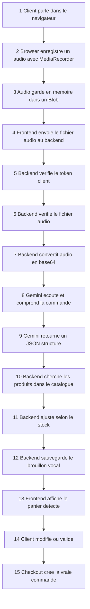
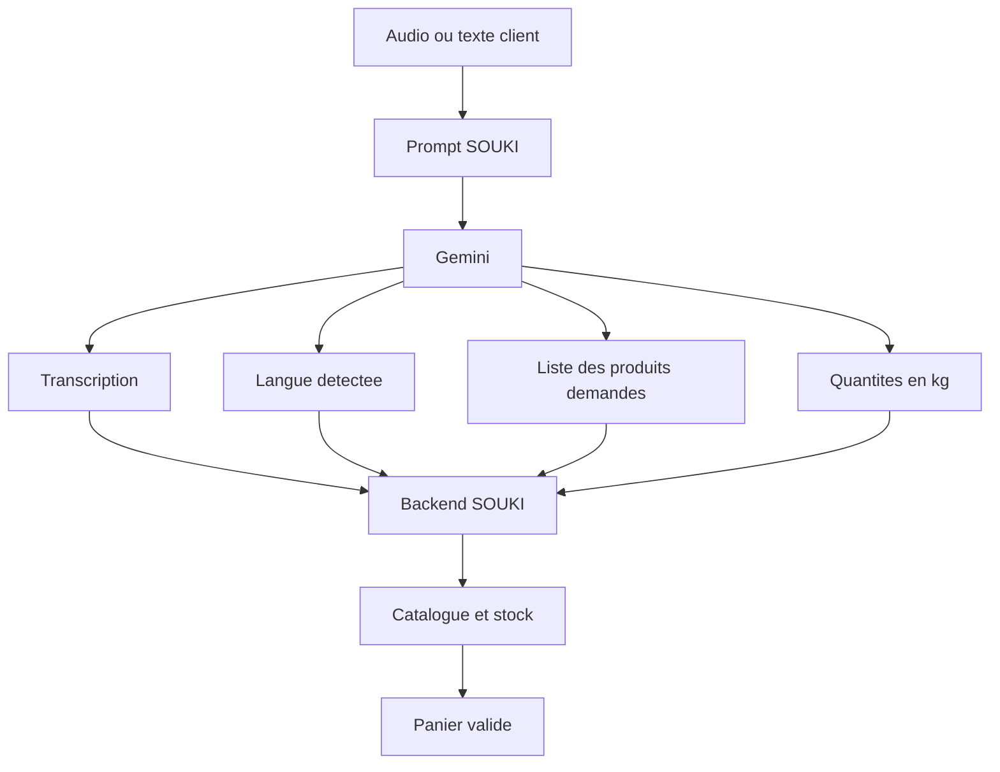
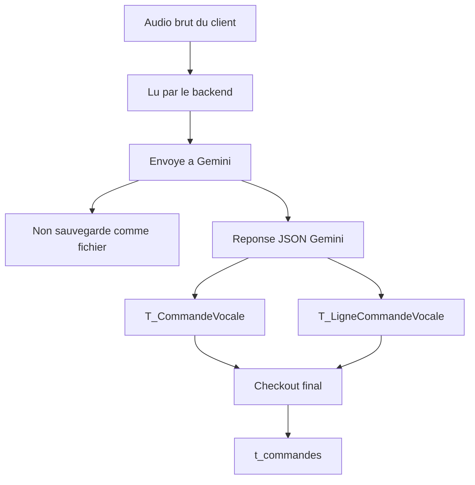
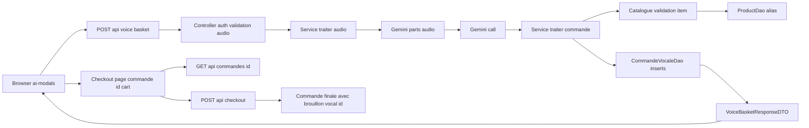
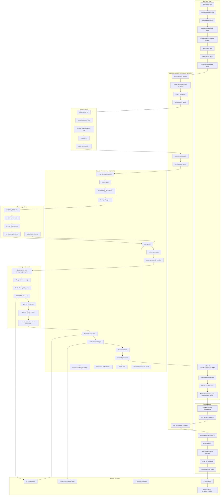
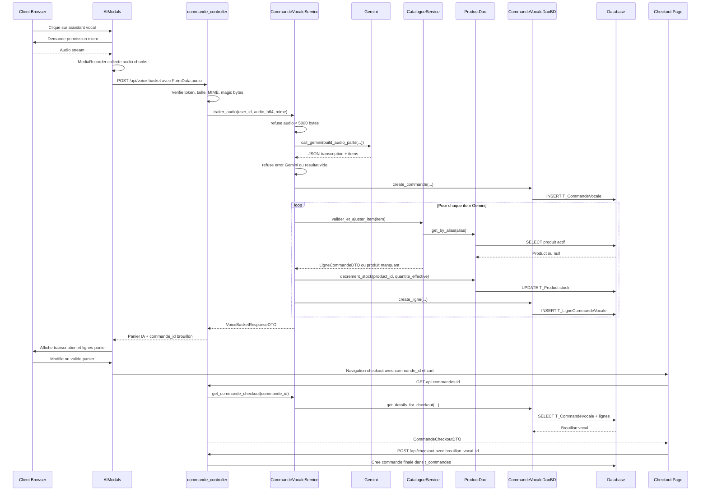

# Commande Vocale SOUKI - Explication A a Z

Ce document explique le fonctionnement complet de la commande vocale SOUKI, depuis le navigateur jusqu'a la creation de la commande finale. Il couvre le frontend, les endpoints API, les DTOs, les services, Gemini, le catalogue, les DAOs, les entities, les tables SQL, les formats de donnees, les fonctions cles, les erreurs et les points d'attention techniques.

## 1. Vue Globale

La commande vocale fonctionne en deux temps :

1. Le client parle dans le navigateur. Le frontend enregistre un audio, l'envoie au backend, Gemini extrait les produits, le backend cree un brouillon vocal et retourne un panier IA.
2. Le client valide/modifie ce panier dans le checkout. Le checkout envoie ensuite une vraie commande finale avec `brouillon_vocal_id`.

### 1.1 Schema simple pour soutenance

Ce schema explique l'idee principale : l'audio n'est pas sauvegarde comme fichier. Il est seulement lu, valide, envoye a Gemini pour comprehension, puis le resultat structure est sauvegarde en base.



Explication orale simple :

| Etape | Ce qui se passe | Ce qui est sauvegarde |
|---|---|---|
| Client parle | Le client dicte sa commande dans la modale. | Rien. |
| Browser enregistre | `MediaRecorder` cree un audio `webm` en memoire. | Rien dans la base. |
| Backend recoit | Le fichier arrive sur `/api/voice-basket`. | Toujours rien, le fichier est seulement lu. |
| Validation audio | Le backend verifie taille, format et contenu reel. | Rien. |
| Envoi Gemini | Le backend convertit l'audio en base64 et l'envoie a Gemini. | L'audio lui-meme n'est pas stocke. |
| Role Gemini | Gemini transforme la parole en JSON : transcription, langue, produits, quantites. | Rien directement, Gemini renvoie seulement une reponse. |
| Traitement metier | Le backend verifie les produits dans le catalogue et le stock. | Brouillon vocal et lignes vocales. |
| Affichage client | Le frontend affiche le panier detecte. | Deja sauvegarde comme brouillon. |
| Checkout | Le client valide adresse, paiement, creneau. | Vraie commande dans `t_commandes`. |

### 1.2 Role exact de Gemini

Gemini n'est pas le systeme qui cree la commande finale. Gemini joue seulement le role d'assistant de comprehension.



Ce que Gemini fait :

| Gemini fait | Gemini ne fait pas |
|---|---|
| Ecoute ou lit la commande client. | Ne cree pas la commande finale. |
| Detecte la langue : darija, francais, mixte. | Ne decide pas le prix officiel. |
| Extrait les noms de produits. | Ne modifie pas directement la base de donnees. |
| Convertit les quantites en kg. | Ne verifie pas le stock reel. |
| Retourne un JSON structure. | Ne valide pas le paiement ni la livraison. |

Le backend SOUKI garde donc le controle metier : catalogue, prix, stock, sauvegarde, checkout et commande finale.

### 1.3 Ce qui est sauvegarde et ce qui ne l'est pas



En base de donnees, le systeme sauvegarde :

| Table | Contenu sauvegarde |
|---|---|
| `T_CommandeVocale` | `user_id`, transcription brute, JSON Gemini brut, langue detectee, date de creation. |
| `T_LigneCommandeVocale` | Produit, quantite demandee, quantite effective, prix unitaire, sous-total, message d'ajustement. |
| `t_commandes` | La commande finale, uniquement apres validation checkout. |

Le systeme ne sauvegarde pas le fichier audio original dans une table ou dans Supabase Storage dans le flux lu ici. Si l'audio est trop petit ou si Gemini ne detecte ni transcription ni produit, aucun brouillon vocal n'est cree.

### 1.4 Schema global technique



Vue detaillee en flowchart, plus pratique a zoomer que le diagramme de sequence :



Vue detaillee du meme flux, avec les responsabilites principales :



## 2. Fichiers Impliques

| Couche | Fichier | Role |
|---|---|---|
| Frontend modal IA | `front-end/components/souki/ai-modals.tsx` | Enregistrement micro, appel `/api/voice-basket`, affichage panier IA, redirection checkout. |
| Frontend checkout | `front-end/app/checkout/page.tsx` | Recharge le brouillon vocal, construit le panier checkout, envoie la commande finale. |
| API shared frontend | `front-end/lib/api.ts` | Types admin/client lies aux commandes et fiche client; le flux vocal principal utilise surtout `fetch` direct. |
| Controller | `back-end/controllers/commande_controller.py` | Routes voix, validation audio, auth, encodage base64. |
| Service vocal | `back-end/services/commande_service.py` | Appelle Gemini, cree le brouillon vocal, valide les produits et calcule le panier. |
| Gemini | `back-end/api/algorithms.py` | Prompt systeme, modeles Gemini, timeout, parsing JSON. |
| Catalogue | `back-end/services/catalogue_service.py` | Matching produit, ajustement quantite selon stock. |
| DAO commande | `back-end/dao/commande_dao.py` | Insert/lecture de `T_CommandeVocale`, `T_LigneCommandeVocale`, checkout, admin. |
| DAO produit | `back-end/dao/product_dao.py` | Recherche produit par alias, decrement stock. |
| DTOs | `back-end/dto/commande_dto.py` | Contrats Pydantic des reponses et requetes vocales/checkout. |
| Interfaces | `back-end/interfaces/commande_service_interface.py`, `back-end/interfaces/commande_dao_interface.py` | Contrats abstraits service/DAO. |
| Entities | `back-end/entities/commande_vocale_entity.py`, `back-end/entities/commande_entity.py`, `back-end/entities/product_entity.py` | Tables et relations SQLAlchemy. |
| Injection dependances | `back-end/dependencies.py` | Fabrique `CommandeVocaleService(product_dao, commande_dao)`. |

## 3. Flux Frontend Navigateur

### 3.1 Ouverture de la modale IA

Le composant principal est `AIModals` dans `front-end/components/souki/ai-modals.tsx`.

Il recoit notamment :

| Prop | Role |
|---|---|
| `isOpen` | Indique si la modale est ouverte. |
| `mode` | `"voice"` ou `"smart"`. La commande vocale utilise `"voice"`. |
| `products` | Catalogue frontend utilise pour le panier intelligent, pas pour Gemini. |
| `onApplySelections` | Callback pour appliquer des selections. |
| `isOrderLocked` | Bloque l'assistant si les commandes sont fermees. |
| `orderLockMessage` | Message affiche si commande verrouillee. |

### 3.2 Enregistrement audio dans le navigateur

La fonction cle est `handleVoiceInteraction()`.

| Etape | Detail |
|---|---|
| Verification verrou | Si `isOrderLocked`, la fonction affiche `orderLockMessage` et s'arrete. |
| Verification auth | Si aucun `token`, message : connexion requise. |
| Demarrage micro | Appelle `navigator.mediaDevices.getUserMedia({ audio: true })`. |
| Format prefere | Si supporte, utilise `MediaRecorder` avec `mimeType: "audio/webm"`. |
| Collecte audio | `mediaRecorder.ondataavailable` pousse les chunks dans `audioChunksRef.current`. |
| Stop | Si l'utilisateur reclique, `stopListening()` appelle `mediaRecorder.stop()`. |

### 3.3 Envoi au backend

Quand l'enregistrement s'arrete, `mediaRecorder.onstop` :

1. Stoppe les tracks du micro.
2. Cree un `Blob` avec les chunks audio.
3. Cree un `FormData`.
4. Ajoute le fichier sous la cle `audio`.
5. Appelle `POST ${API_BASE_URL}/api/voice-basket`.

Un `Blob` est un objet du navigateur qui represente un fichier ou des donnees binaires en memoire. Dans ce flux, le navigateur enregistre la voix en petits morceaux audio, puis `new Blob(audioChunksRef.current, { type: "audio/webm" })` rassemble ces morceaux pour former un seul fichier audio temporaire.

Phrase simple pour soutenance :

> Un Blob est un fichier temporaire cree par le navigateur. Ici, il contient l'audio enregistre par le micro. Il n'est pas sauvegarde : il sert seulement a envoyer l'audio au backend.

Format envoye :

```http
POST /api/voice-basket
Authorization: Bearer <token>
Content-Type: multipart/form-data

audio=<Blob audio/webm, filename=enregistrement.webm>
```

Le frontend ne force pas lui-meme une duree maximale; la securite principale est cote backend.

### 3.4 Reception du panier IA

Si la reponse est OK :

```ts
const data = (await response.json()) as VoiceBasketResponseDTO
setResult(data)
```

Le panier detecte est copie dans `editedBasket` via un `useEffect` :

```ts
if (result) {
  setEditedBasket([...result.lignes_panier])
}
```

L'utilisateur peut ensuite modifier les quantites ou supprimer des lignes dans la modale avant de partir au checkout.

### 3.5 Passage au checkout

La fonction `handleVoiceCheckout()` :

1. Verifie `result.commande_id`.
2. Transforme `editedBasket` en tableau `checkoutCart`.
3. Encode ce panier dans l'URL avec `encodeURIComponent(JSON.stringify(checkoutCart))`.
4. Redirige vers :

```txt
/checkout?commande_id=<id_brouillon_vocal>&cart=<panier_encode>
```

Le `commande_id` correspond a l'ID de `T_CommandeVocale`, pas encore a une vraie commande finale dans `t_commandes`.

## 4. Flux Checkout Vocal

Le fichier concerne est `front-end/app/checkout/page.tsx`.

### 4.1 Parametres URL

Le checkout lit :

| Parametre | Role |
|---|---|
| `commande_id` | ID du brouillon vocal `T_CommandeVocale.id`. |
| `panier_id` | Flux panier manuel, separe du vocal. |
| `cart` | Panier edite cote frontend, passe en JSON encode. |

### 4.2 Chargement du brouillon vocal

Si `commande_id` existe :

```http
GET /api/commandes/{commande_id}
Authorization: Bearer <token>
```

Le backend retourne un `CommandeCheckoutDTO`.

Si `cart` est present, le checkout privilegie ce panier edite par l'utilisateur. Sinon il utilise les lignes retournees par le backend.

### 4.3 Construction du panier checkout

La fonction `buildCartItems()` normalise plusieurs formats possibles :

| Source possible | Champ normalise |
|---|---|
| `line.id` ou `line.product_id` | `CartItem.id` |
| `line.name`, `line.nom_produit`, `line.nom_fr` | `CartItem.name` |
| `line.price`, `line.prix_unitaire`, `line.prix_kg` | `CartItem.price` |
| `line.quantity`, `line.quantite_effective`, `line.quantite_kg` | `CartItem.quantity` |
| `line.unit`, `line.unite` | `CartItem.unit` |

### 4.4 Creation de la commande finale

La fonction `handleSubmitOrder()` envoie :

```json
{
  "items": [
    {
      "product_id": 1,
      "quantity": 2
    }
  ],
  "creneau_livraison": "8-10",
  "mode_paiement": "cod",
  "contact_phone": "0600000000",
  "delivery_address": "Adresse client",
  "delivery_city": "Ville",
  "delivery_instructions": null,
  "brouillon_vocal_id": 123
}
```

Endpoint :

```http
POST /api/checkout
Authorization: Bearer <token>
Content-Type: application/json
```

Important : a ce moment seulement, le brouillon vocal devient rattache a une vraie commande finale via `t_commandes.brouillon_vocal_id`.

## 5. Endpoints Backend

Les routes vocales sont declarees dans `back-end/controllers/commande_controller.py` avec :

```python
router_voice = APIRouter(prefix="/api", tags=["Voice AI"])
```

### 5.1 `POST /api/voice-basket`

| Element | Detail |
|---|---|
| Fonction | `process_voice_basket()` |
| Auth | `require_permission("client.dashboard.access", "parent.dashboard.access", match="any")` |
| Body | `multipart/form-data`, fichier `audio` |
| Validation | fichier present, non vide, taille, MIME, magic bytes |
| Sortie | `VoiceBasketResponseDTO` |

Flux interne :

1. Lit `audio.file.read()`.
2. Rejette fichier absent/vide/illisible.
3. Appelle `_validate_audio_upload(audio_bytes, audio.content_type)`.
4. Encode l'audio en base64.
5. Ouvre le service avec `with service:`.
6. Appelle `service.traiter_audio(principal.user_id, audio_b64, mime)`.
7. Le service refuse l'audio si les bytes decodes font moins de 5000 bytes.
8. Le service refuse la reponse Gemini si elle contient `error` ou si elle ne contient ni transcription ni item.

### 5.2 `POST /api/text-basket`

| Element | Detail |
|---|---|
| Fonction | `process_text_basket()` |
| Auth | Meme permission client/parent que le vocal |
| Body | `TextBasketRequest` |
| Sortie | `VoiceBasketResponseDTO` |

Ce endpoint utilise le meme moteur metier, mais avec du texte au lieu d'un audio.

Exemple :

```json
{
  "texte": "Deux kilos de pommes de terre et un kilo d'oignons"
}
```

### 5.3 `GET /api/commandes/{commande_id}`

| Element | Detail |
|---|---|
| Fonction | `get_commande_checkout()` |
| Auth | `require_auth` |
| Parametre | `commande_id` |
| Sortie | `CommandeCheckoutDTO` |
| Usage | Pre-remplir le checkout depuis un brouillon vocal |

La route appelle :

```python
detail = service.get_commande_checkout(commande_id)
```

Si aucun brouillon n'est trouve, elle retourne `404`.

## 6. Validation Audio Backend

Les constantes actuelles dans `commande_controller.py` :

```python
MAX_AUDIO_SIZE_BYTES = 10 * 1024 * 1024
MAX_AUDIO_DURATION_SECONDS = 60
ALLOWED_AUDIO_FORMATS = {
    "audio/wav",
    "audio/wave",
    "audio/x-wav",
    "audio/mpeg",
    "audio/mp3",
    "audio/webm",
    "audio/ogg",
}
```

### 6.1 `_normalize_audio_content_type()`

| Entree | Sortie |
|---|---|
| `audio/wave` | `audio/wav` |
| `audio/x-wav` | `audio/wav` |
| `audio/mpeg` | `audio/mp3` |
| autre MIME | valeur nettoyee en minuscules |

Role : eviter que deux noms MIME equivalents soient traites differemment.

### 6.2 `_validate_wav_duration()`

Cette fonction ouvre le fichier avec le module Python `wave`, calcule :

```python
duration_seconds = frame_count / float(frame_rate)
```

Puis rejette si la duree depasse 60 secondes.

Important : la duree est verifiee explicitement pour WAV. Les formats MP3/WebM/OGG sont valides par magic bytes et taille, mais leur duree n'est pas calculee dans ce code.

### 6.3 `_validate_audio_upload()`

La fonction verifie :

| Controle | Comportement |
|---|---|
| Taille > 10 Mo | `400 Audio trop grand. Maximum 10 Mo.` |
| MIME non autorise | `400 Format audio non supporte.` |
| `RIFF` | WAV, puis verification duree |
| `ID3`, `FF FB`, `FF F3`, `FF F2` | MP3 |
| `1A 45 DF A3` | WebM |
| `OggS` | OGG |
| autre signature | `400 Contenu audio invalide.` |

Sortie : le MIME normalise a transmettre a Gemini.

### 6.4 Avant la conversion base64, que verifie le backend ?

Avant de convertir l'audio en base64, le backend fait plusieurs controles de securite et de validite. L'objectif est de ne jamais envoyer a Gemini un fichier vide, trop grand, de mauvais format ou deguise en audio.

Dans `process_voice_basket()`, le backend verifie d'abord :

| Verification | Pourquoi |
|---|---|
| Le fichier `audio` existe | Eviter une requete sans fichier. |
| `audio.filename` existe | Confirmer qu'un vrai fichier a ete transmis par `FormData`. |
| Le fichier peut etre lu | Eviter de traiter un upload corrompu ou illisible. |
| `len(audio_bytes) > 0` | Refuser un fichier vide. |

Ensuite `_validate_audio_upload()` verifie :

| Verification | Detail | Risque evite |
|---|---|---|
| Taille maximale | Maximum `10 Mo`. | Fichiers trop lourds, abus serveur. |
| MIME declare | `audio/wav`, `audio/mp3`, `audio/webm`, `audio/ogg`. | Formats non supportes. |
| Magic bytes | Verifie les premiers octets reels du fichier. | Fichier deguise, par exemple script renomme en audio. |
| Duree WAV | Maximum `60 secondes` pour WAV. | Audio trop long. |

Exemples de magic bytes :

| Format | Signature verifiee |
|---|---|
| WAV | commence par `RIFF` |
| MP3 | commence par `ID3` ou certains octets `FF FB`, `FF F3`, `FF F2` |
| WebM | commence par `1A 45 DF A3` |
| OGG | commence par `OggS` |

Donc l'ordre est important :

```txt
Reception fichier audio
-> lecture bytes
-> verification fichier non vide
-> verification taille, MIME et contenu reel
-> seulement apres, conversion base64
-> envoi a Gemini
```

Phrase simple pour soutenance :

> Avant la conversion base64, le backend verifie que le fichier existe, qu'il n'est pas vide, qu'il ne depasse pas 10 Mo, que son format est autorise et que son contenu correspond vraiment a un audio grace aux magic bytes.

### 6.5 Validation metier supplementaire dans le service

Apres la conversion base64 par le controller, `CommandeVocaleService.traiter_audio()` refait deux controles avant de creer un brouillon vocal :

| Controle | Fonction | Pourquoi |
|---|---|---|
| Taille minimale decoded bytes | `_validate_audio_payload()` | Eviter qu'un audio quasi vide ou trop petit parte a Gemini. |
| Resultat Gemini vide | `_validate_gemini_audio_result()` | Eviter de sauvegarder un brouillon vocal si Gemini ne detecte ni transcription ni produit. |
| Erreur Gemini safe | `_validate_gemini_audio_result()` | Transformer un retour `error` de Gemini en erreur HTTP 502 claire. |

Constante service :

```python
MIN_AUDIO_SIZE_BYTES = 5000
```

Flux exact :

```txt
controller valide format et magic bytes
-> controller encode en base64
-> service decode le base64 pour verifier taille >= 5000 bytes
-> service appelle Gemini
-> service refuse si Gemini retourne error
-> service refuse si transcription vide et items vides
-> seulement apres, creation T_CommandeVocale
```

Effet important : un silence qui passe la validation de format ne cree plus de brouillon vocal inutile.

### 6.6 Pourquoi convertir l'audio en base64 ?

Le backend recoit l'audio sous forme de bytes bruts. Pour construire la requete Gemini, le code utilise une fonction intermediaire :

```python
audio_b64 = base64.b64encode(audio_bytes).decode("utf-8")
```

Puis, dans `build_audio_parts()`, ce base64 est retransforme en bytes :

```python
audio_part = types.Part.from_bytes(
    data=base64.b64decode(audio_b64),
    mime_type=mime_type
)
```

La conversion base64 sert ici a transporter l'audio dans une forme texte standard entre le controller et le service. C'est pratique parce qu'une chaine base64 peut circuler facilement dans les fonctions, les logs ou les structures de donnees sans risquer de casser a cause de caracteres binaires.

Important : base64 n'est pas du chiffrement. Cela ne protege pas l'audio. C'est seulement un encodage de transport.

| Sans base64 | Avec base64 |
|---|---|
| Donnees binaires brutes. | Texte ASCII representant ces bytes. |
| Moins pratique a passer dans certains objets ou logs. | Facile a transmettre comme string. |
| Directement utilisable par certaines APIs. | Doit etre decode avant Gemini. |

Dans ce projet, Gemini recoit finalement des bytes, pas le texte base64 directement. Le base64 est donc une etape interne :

```txt
audio bytes backend
-> base64 string dans traiter_audio
-> decode base64 dans build_audio_parts
-> bytes envoyes a Gemini avec le MIME
```

Phrase simple pour soutenance :

> On convertit l'audio en base64 pour le passer proprement du controller au service sous forme de texte. Ensuite, juste avant Gemini, le backend decode ce base64 et cree une piece audio Gemini avec les vrais bytes et le bon MIME. Ce n'est pas une securite, c'est un format de transport.

## 7. DTOs Et Formats De Donnees

Les DTOs sont dans `back-end/dto/commande_dto.py`.

### 7.1 `TextBasketRequest`

```python
class TextBasketRequest(BaseModel):
    texte: str
```

### 7.2 `LigneCommandeDTO`

```python
class LigneCommandeDTO(BaseModel):
    product_id: int
    nom_produit: str
    quantite_demandee: float
    quantite_effective: float
    prix_unitaire: float
    sous_total: float
    message_ajustement: Optional[str] = None
```

### 7.3 `VoiceBasketResponseDTO`

```python
class VoiceBasketResponseDTO(BaseModel):
    status: str
    transcription: Optional[str] = None
    langue_detectee: Optional[str] = None
    produits_non_disponibles: List[str] = []
    lignes_panier: List[LigneCommandeDTO] = []
    total_dh: float = 0.0
    nombre_articles: int = 0
    commande_id: Optional[int] = None
```

Exemple de reponse :

```json
{
  "status": "success",
  "transcription": "Je veux deux kilos de pommes de terre et un kilo d'oignons",
  "langue_detectee": "français",
  "produits_non_disponibles": [],
  "lignes_panier": [
    {
      "product_id": 1,
      "nom_produit": "Pommes de terre",
      "quantite_demandee": 2.0,
      "quantite_effective": 2.0,
      "prix_unitaire": 7.0,
      "sous_total": 14.0,
      "message_ajustement": null
    }
  ],
  "total_dh": 14.0,
  "nombre_articles": 1,
  "commande_id": 123
}
```

### 7.4 `CommandeCheckoutDTO`

```python
class CommandeCheckoutDTO(BaseModel):
    commande_id: int
    transcription: Optional[str] = None
    lignes: List[LigneCheckoutDTO]
    total_dh: float
```

### 7.5 `LigneCheckoutDTO`

```python
class LigneCheckoutDTO(BaseModel):
    product_id: int
    nom_produit: str
    quantite_effective: float
    prix_unitaire: float
    sous_total: float
    unite: str
    image: str = "<image par defaut>"
```

### 7.6 `CommandeVocaleClientDTO`

Utilise dans la fiche client admin :

```python
class CommandeVocaleClientDTO(BaseModel):
    id: int
    created_at: Optional[datetime] = None
    langue_detectee: Optional[str] = None
    transcription_brute: Optional[str] = None
```

## 8. Gemini

Le fichier est `back-end/api/algorithms.py`.

### 8.1 Modeles utilises

Ordre de priorite :

```python
MODELS = [
    "models/gemini-2.5-flash",
    "models/gemini-2.0-flash",
    "models/gemini-2.0-flash-lite",
]
```

Timeout :

```python
GEMINI_TIMEOUT_SECONDS = 30
```

### 8.2 Prompt systeme

Gemini recoit un prompt qui lui impose de retourner uniquement du JSON valide.

Format attendu :

```json
{
  "transcription": "texte",
  "langue_detectee": "darija|français|mixte",
  "items": [
    {
      "produit_darija": "btata",
      "produit_fr": "Pommes de terre",
      "quantite": 2.0,
      "unite": "kg"
    }
  ],
  "produits_non_disponibles": []
}
```

Le prompt force aussi des conversions de quantites :

| Expression | Quantite |
|---|---|
| `nos`, `noss` | `0.5` |
| `rab3a`, `reb3a` | `0.25` |
| `thelth`, `tlata` | `0.33` |
| `un lot`, `une botte`, `un paquet` | `1.0` |
| `500g` | `0.5` |
| `250g` | `0.25` |

### 8.2.1 Comment Gemini ecoute et comprend la commande ?

Gemini ne "comprend" pas la commande comme un humain qui execute directement une action. Il recoit deux choses :

1. **Le prompt SOUKI** : ce sont les instructions metier qui expliquent quoi extraire.
2. **L'audio du client** : le fichier audio decode et envoye comme `Part` Gemini.

Dans le code, le backend construit cette liste :

```python
return [
    SYSTEM_PROMPT,
    audio_part,
    "Analyse cette commande vocale et retourne le JSON structure."
]
```

Gemini utilise alors ses capacites multimodales :

| Capacite Gemini | Role dans SOUKI |
|---|---|
| Reconnaissance audio | Transformer la voix en texte comprehensible. |
| Comprehension de langue | Comprendre francais, darija ou melange des deux. |
| Extraction d'information | Trouver les produits demandes. |
| Normalisation | Convertir les quantites en nombres et en kg. |
| Structuration | Retourner un JSON exploitable par le backend. |

Exemple :

Si le client dit :

```txt
Bghit jouj kilo btata w nos kilo maticha
```

Gemini doit produire une structure comme :

```json
{
  "transcription": "Bghit jouj kilo btata w nos kilo maticha",
  "langue_detectee": "darija",
  "items": [
    {
      "produit_darija": "btata",
      "produit_fr": "Pommes de terre",
      "quantite": 2.0,
      "unite": "kg"
    },
    {
      "produit_darija": "maticha",
      "produit_fr": "Tomates",
      "quantite": 0.5,
      "unite": "kg"
    }
  ],
  "produits_non_disponibles": []
}
```

Le point important : Gemini ne touche pas a la base de donnees. Il renvoie seulement une interpretation. Ensuite, le backend SOUKI decide si les produits existent vraiment, si le stock est suffisant, quel prix appliquer et quoi sauvegarder.

Phrase simple pour soutenance :

> Gemini recoit l'audio avec un prompt SOUKI. Le prompt lui dit exactement quoi extraire : transcription, langue, produits, quantites et unite. Gemini transforme donc la voix en JSON structure. Ensuite, le backend verifie ce JSON avec le catalogue et le stock avant de creer le panier.

### 8.2.2 Pourquoi le prompt est important ?

Sans prompt precis, Gemini pourrait repondre avec une phrase naturelle comme :

```txt
Le client veut deux kilos de pommes de terre.
```

Mais le backend a besoin d'un format stable et lisible par le code. Le prompt oblige donc Gemini a retourner :

```json
{
  "transcription": "...",
  "langue_detectee": "...",
  "items": [],
  "produits_non_disponibles": []
}
```

Le prompt joue donc le role de contrat entre l'intelligence artificielle et le backend.

| Sans prompt strict | Avec prompt strict |
|---|---|
| Reponse naturelle difficile a parser. | JSON stable pour le backend. |
| Risque de texte libre. | Champs attendus : `transcription`, `langue_detectee`, `items`. |
| Quantites parfois ambigues. | Regles : `nos = 0.5`, `500g = 0.5`, etc. |
| Le backend ne sait pas quoi faire. | Le backend peut boucler sur `items`. |

### 8.2.3 Comment les produits sont identifies ?

Dans la commande vocale, tout ce que le client dit n'est pas forcement un produit. Le role de Gemini est de separer :

- les vrais noms de produits commandables ;
- les mots de liaison ;
- les quantites ;
- les noms propres ou mots qui ne correspondent pas a des produits.

Exemple :

```txt
Wahit kilo dial Hamza, jouj kilo dial Taha, khamsa kilo dial btata, setta kilo dial bsla
```

Gemini peut garder toute la phrase dans la transcription, mais il ne met dans `items` que les elements qu'il reconnait comme produits :

```json
{
  "items": [
    {
      "produit_darija": "btata",
      "produit_fr": "Pommes de terre",
      "quantite": 5.0,
      "unite": "kg"
    },
    {
      "produit_darija": "bsla",
      "produit_fr": "Oignons",
      "quantite": 6.0,
      "unite": "kg"
    }
  ]
}
```

Pourquoi `Hamza` et `Taha` ne sont pas identifies comme produits ?

Parce qu'ils ressemblent a des noms propres, pas a des legumes ou produits du catalogue. Gemini les conserve dans la transcription, mais ne les ajoute pas dans `items`. Ensuite, le backend ne traite que les elements presents dans `items`.

Le backend fait ensuite une deuxieme verification :

```txt
item Gemini
-> alias produit francais ou darija
-> recherche dans le catalogue SOUKI
-> si trouve : produit ajoute au panier
-> si non trouve : produit non disponible
```

Donc l'identification des produits se fait en deux niveaux :

| Niveau | Responsable | Role |
|---|---|---|
| 1 | Gemini | Comprendre la phrase et extraire les mots qui semblent etre des produits. |
| 2 | Backend SOUKI | Verifier que ces produits existent vraiment dans le catalogue. |

Phrase simple pour soutenance :

> Gemini ne transforme pas tous les mots en produits. Il garde la phrase complete comme transcription, puis il extrait seulement les mots qui ressemblent a des produits commandables. Ensuite, SOUKI verifie ces produits dans son catalogue. C'est pour cela que des noms comme Hamza ou Taha peuvent etre ignores : ils ne sont pas reconnus comme produits.

### 8.3 `build_audio_parts()`

| Element | Detail |
|---|---|
| Entree | `audio_b64`, `mime_type` |
| Action | Decode le base64 et cree un `types.Part.from_bytes(...)` |
| Sortie | Liste de parts Gemini : prompt systeme, audio, instruction finale |

### 8.4 `build_text_parts()`

| Element | Detail |
|---|---|
| Entree | texte client |
| Action | Ajoute le texte dans le prompt |
| Sortie | Liste de parts Gemini sans audio |

### 8.5 `_generate_content_with_timeout()`

Utilise un `ThreadPoolExecutor` pour executer :

```python
client.models.generate_content(
    model=model_name,
    contents=prompt_parts,
)
```

Si Gemini depasse 30 secondes, la fonction leve un timeout.

### 8.6 `call_gemini()`

Role :

1. Cree un client Gemini avec `GEMINI_API_KEY`.
2. Essaie les modeles dans l'ordre.
3. Essaie jusqu'a 3 tentatives par modele.
4. Nettoie les fences Markdown eventuelles :
   - ```json
   - ```
5. Parse la reponse avec `json.loads(raw)`.
6. Retourne toujours un dict safe en cas d'erreur.

Cas d'erreur :

| Erreur | Comportement |
|---|---|
| Timeout | Retourne `items: []` et `error: "Gemini timeout"`. |
| `503` | Attend 2s puis retry. |
| `429` ou quota | Passe au modele suivant. |
| `403` | Retourne `Access denied`. |
| Autre erreur | Retourne `Internal error: ...`. |

## 9. Service Vocal

Le service principal est `CommandeVocaleService` dans `back-end/services/commande_service.py`.

### 9.1 Construction

```python
def __init__(self, product_dao: IProductDao, commande_dao: ICommandeVocaleDao)
```

Le service recoit deux dependances :

| Dependances | Role |
|---|---|
| `product_dao` | Recherche et mise a jour des produits. |
| `commande_dao` | Creation/lecture des brouillons vocaux et commandes. |

### 9.2 Context manager

| Fonction | Role |
|---|---|
| `__enter__()` | Cree `LocalSession()` et instancie `CatalogueService(self.product_dao, self.session)`. |
| `__exit__()` | `rollback()` si exception, sinon `commit()`, puis `close()`. |

Les controllers utilisent donc :

```python
with service:
    return service.traiter_audio(...)
```

### 9.3 `traiter_audio()`

| Entree | Sortie |
|---|---|
| `user_id`, `audio_b64`, `mime_type` | `VoiceBasketResponseDTO` |

Etapes :

1. `parts = build_audio_parts(audio_b64, mime_type)`.
2. `_validate_audio_payload(audio_b64)` decode le base64 et refuse un audio de moins de 5000 bytes.
3. `gemini_result = call_gemini(parts)`.
4. `_validate_gemini_audio_result(gemini_result)` refuse les erreurs Gemini et les retours audio vides.
5. Appelle `_traiter_commande(...)`.

Important : `_traiter_commande()` cree le brouillon vocal. Les validations audio du service se font avant cette etape pour eviter d'ecrire en base un brouillon vide.

### 9.4 `traiter_texte()`

Meme logique que l'audio, mais avec :

```python
parts = build_text_parts(texte)
```

Ce endpoint est utile pour tester le moteur IA sans micro.

### 9.5 `_traiter_commande()`

C'est la fonction metier centrale.

Etapes :

1. Cree une ligne dans `T_CommandeVocale` via `commande_dao.create_commande(...)`.
2. Lit `items` dans le JSON Gemini.
3. Logge la reponse brute Gemini avec `print(...)`.
4. Pour chaque item Gemini :
   - appelle `catalogue_service.valider_et_ajuster_item(item)`;
   - si produit valide, decremente le stock;
   - cree une ligne dans `T_LigneCommandeVocale`;
   - ajoute la ligne au DTO de reponse;
   - additionne le total.
5. Si produit non trouve ou stock a zero, ajoute le nom dans `produits_non_disponibles`.
6. Retourne `VoiceBasketResponseDTO`.

### 9.6 `get_commande_checkout()`

Cette methode :

1. Appelle `commande_dao.get_details_for_checkout(...)`.
2. Transforme les lignes dict en `LigneCheckoutDTO`.
3. Calcule `total_dh`.
4. Retourne `CommandeCheckoutDTO`.

### 9.7 `get_fiche_client()`

Cette methode delegue au DAO pour retourner la fiche client complete, incluant les commandes vocales dans `commandes_vocales`.

## 10. Catalogue Matching

Le fichier est `back-end/services/catalogue_service.py`.

### 10.1 `valider_et_ajuster_item()`

Entree : un item Gemini.

Exemple :

```json
{
  "produit_darija": "btata",
  "produit_fr": "Pommes de terre",
  "quantite": 2.0,
  "unite": "kg"
}
```

Etapes :

1. Choisit l'alias :
   ```python
   alias = item_gemini.get("produit_fr") or item_gemini.get("produit_darija")
   ```
2. Cherche le produit :
   ```python
   produit = self.product_dao.get_by_alias(session, str(alias))
   ```
3. Convertit la quantite :
   ```python
   qte_demandee = float(item_gemini.get("quantite", 1.0))
   ```
4. Compare avec le stock.
5. Si la quantite demandee depasse le stock :
   - `quantite_effective = stock`;
   - si stock = 0, produit non disponible;
   - sinon message d'ajustement.
6. Calcule :
   ```python
   sous_total = round(qte_effective * prix_kg, 2)
   ```
7. Retourne `LigneCommandeDTO`.

### 10.2 `ProductDao.get_by_alias()`

Le fichier est `back-end/dao/product_dao.py`.

La methode :

1. Normalise l'alias.
2. Calcule une version singulier.
3. Parcourt les produits actifs :
   ```python
   session.query(Product).filter(Product.is_active == True).all()
   ```
4. Construit les alias du produit.
5. Match si :
   - alias exact;
   - alias singulier;
   - alias contenu dans candidat;
   - candidat contenu dans alias.

### 10.3 `ProductDao.decrement_stock()`

Cette methode diminue le stock si :

```python
product and float(product.stock) >= quantity
```

Puis :

```python
product.stock = float(product.stock) - quantity
```

Point d'attention : la methode fait actuellement `session.commit()` dans le DAO. Cela fonctionne, mais ce n'est pas strictement aligne avec une convention MVC2 stricte ou les DAOs ne font que `flush()`.

## 11. DAO Commande Vocale

Le DAO principal est `CommandeVocaleDaoBD` dans `back-end/dao/commande_dao.py`.

### 11.1 `create_commande()`

Insere dans `T_CommandeVocale` :

| Champ | Source |
|---|---|
| `user_id` | `principal.user_id` |
| `transcription_brute` | transcription Gemini |
| `json_gemini_brut` | JSON complet retourne par Gemini |
| `langue_detectee` | `langue_detectee` Gemini |

Point d'attention : cette methode fait `session.flush()` puis `session.commit()` dans le DAO.

### 11.2 `create_ligne()`

Insere dans `T_LigneCommandeVocale` :

| Champ | Source |
|---|---|
| `commande_id` | ID du brouillon vocal |
| `product_id` | Produit trouve |
| `quantite_demandee` | Quantite Gemini |
| `quantite_effective` | Quantite ajustee au stock |
| `prix_unitaire` | Prix produit |
| `sous_total` | Total ligne |
| `message_ajustement` | Message si stock limite |

Point d'attention : cette methode fait aussi `session.commit()` dans le DAO.

### 11.3 `get_details_for_checkout()`

Recharge un brouillon vocal par ID :

```python
cmd = session.query(CommandeVocale).filter(CommandeVocale.id == commande_id).first()
```

Puis transforme les lignes en dict :

```json
{
  "product_id": 1,
  "nom_produit": "Pommes de terre",
  "quantite_effective": 2.0,
  "prix_unitaire": 7.0,
  "sous_total": 14.0,
  "unite": "kg"
}
```

Retourne :

```json
{
  "commande_id": 123,
  "transcription": "texte transcrit",
  "lignes": []
}
```

### 11.4 Autres methodes liees

| Methode | Role |
|---|---|
| `get_commandes_du_jour()` | Retourne les commandes finales du jour, BROUILLON exclu. |
| `get_historique_client()` | Retourne l'historique final du client, BROUILLON exclu. |
| `get_fiche_client()` | Retourne la fiche admin avec commandes finales et commandes vocales. |

## 12. Entities Et Tables SQL

### 12.1 `CommandeVocale`

Fichier : `back-end/entities/commande_vocale_entity.py`

Table :

```python
__tablename__ = "T_CommandeVocale"
```

Champs :

| Colonne | Type | Role |
|---|---|---|
| `id` | Integer PK | ID du brouillon vocal. |
| `user_id` | FK `t_users.id` | Client auteur du brouillon. |
| `transcription_brute` | Text | Texte reconnu/extrait. |
| `json_gemini_brut` | Text | Reponse brute Gemini serialisee. |
| `langue_detectee` | String(50) | Langue detectee par Gemini. |
| `created_at` | DateTime | Date de creation. |

Relation :

```python
lignes = relationship("LigneCommandeVocale", back_populates="commande")
```

### 12.2 `LigneCommandeVocale`

Table :

```python
__tablename__ = "T_LigneCommandeVocale"
```

Champs :

| Colonne | Type | Role |
|---|---|---|
| `id` | Integer PK | ID ligne vocale. |
| `commande_id` | FK `T_CommandeVocale.id` | Brouillon vocal parent. |
| `product_id` | FK `T_Product.id` | Produit catalogue. |
| `quantite_demandee` | Float | Quantite demandee par le client/Gemini. |
| `quantite_effective` | Float | Quantite retenue apres stock. |
| `prix_unitaire` | Float | Prix au moment du brouillon. |
| `sous_total` | Float | Total ligne. |
| `message_ajustement` | String(255) | Message de stock limite. |

Relations :

```python
commande = relationship("CommandeVocale", back_populates="lignes")
produit = relationship("Product", back_populates="lignes_commande_vocale")
```

### 12.3 Lien vers commande finale

Dans `back-end/entities/commande_entity.py`, la vraie commande finale possede :

```python
brouillon_vocal_id = Column(Integer, ForeignKey("T_CommandeVocale.id"), nullable=True)
```

Donc :

| Table | Sens |
|---|---|
| `T_CommandeVocale` | Brouillon cree par l'IA vocale. |
| `T_LigneCommandeVocale` | Lignes detectees dans le brouillon. |
| `t_commandes` | Commande finale validee par le client. |
| `t_commandes.brouillon_vocal_id` | Trace le brouillon vocal d'origine. |

## 13. Interfaces

### 13.1 `ICommandeVocaleService`

Fichier : `back-end/interfaces/commande_service_interface.py`

Contrat :

| Methode | Role |
|---|---|
| `__enter__()` | Ouvre le contexte service. |
| `__exit__()` | Ferme proprement les ressources. |
| `traiter_texte()` | Traite une commande texte. |
| `traiter_audio()` | Traite une commande audio base64. |
| `get_commande_checkout()` | Recupere le brouillon pour checkout. |
| `get_commandes_du_jour()` | Retourne commandes du jour admin. |
| `get_historique_client()` | Retourne historique client. |
| `delete_historique_commande()` | Masque une commande de l'historique. |
| `get_fiche_client()` | Retourne fiche client admin. |

### 13.2 `ICommandeVocaleDao`

Fichier : `back-end/interfaces/commande_dao_interface.py`

Contrat vocal direct :

| Methode | Role |
|---|---|
| `create_commande()` | Cree une commande vocale en BDD. |
| `create_ligne()` | Cree une ligne de commande vocale. |
| `get_details_for_checkout()` | Recupere les donnees pour checkout. |
| `get_commandes_du_jour()` | Liste commandes finales du jour. |
| `get_historique_client()` | Historique final client. |
| `hide_commande_from_client_history()` | Masque historique. |
| `get_fiche_client()` | Fiche client complete. |

L'interface contient aussi des methodes logistiques/COD plus larges, non specifiques au flux vocal.

## 14. Fonctions Cles

### 14.1 Frontend

| Fonction | Fichier | Entree | Sortie | Role | Remarques |
|---|---|---|---|---|---|
| `handleVoiceInteraction()` | `ai-modals.tsx` | clic utilisateur | etat UI + enregistrement | Demarre ou stoppe l'enregistrement vocal. | Verifie token et verrou commande. |
| `stopListening()` | `ai-modals.tsx` | aucun | stop `MediaRecorder` | Arrete l'enregistrement en cours. | Declenche ensuite `onstop`. |
| `mediaRecorder.ondataavailable` | `ai-modals.tsx` | chunk audio | `audioChunksRef` | Accumule les morceaux audio. | Ignore les chunks vides. |
| `mediaRecorder.onstop` | `ai-modals.tsx` | fin enregistrement | appel backend | Cree le `Blob`, le `FormData`, appelle `/api/voice-basket`. | Envoie `Authorization: Bearer`. |
| `handleVoiceCheckout()` | `ai-modals.tsx` | panier IA edite | navigation checkout | Encode le panier et redirige vers `/checkout`. | Utilise `commande_id` du brouillon vocal. |
| `buildCartItems()` | `checkout/page.tsx` | lignes backend/URL | `CartItem[]` | Normalise les champs produit/quantite/prix. | Filtre les lignes invalides. |
| `getCartOverrideFromUrl()` | `checkout/page.tsx` | parametre `cart` | `CartItem[]` ou `null` | Relit le panier edite depuis l'URL. | Essaie JSON direct puis `decodeURIComponent`. |
| `handleSubmitOrder()` | `checkout/page.tsx` | formulaire checkout | POST `/api/checkout` | Cree la commande finale. | Ajoute `brouillon_vocal_id`. |

### 14.2 Controller

| Fonction | Fichier | Entree | Sortie | Role | Remarques |
|---|---|---|---|---|---|
| `_normalize_audio_content_type()` | `commande_controller.py` | MIME brut | MIME normalise | Standardise `audio/wave`, `audio/x-wav`, `audio/mpeg`. | Utilise avant validation. |
| `_validate_wav_duration()` | `commande_controller.py` | bytes WAV | rien ou 400 | Verifie duree WAV <= 60s. | Ne s'applique pas aux autres formats. |
| `_validate_audio_upload()` | `commande_controller.py` | bytes + MIME | MIME final | Verifie taille, MIME, magic bytes. | Rejette contenu deguise. |
| `process_voice_basket()` | `commande_controller.py` | `UploadFile audio` | `VoiceBasketResponseDTO` | Point d'entree audio. | Lit le fichier en memoire. |
| `process_text_basket()` | `commande_controller.py` | `TextBasketRequest` | `VoiceBasketResponseDTO` | Point d'entree texte. | Meme service que vocal. |
| `get_commande_checkout()` | `commande_controller.py` | `commande_id` | `CommandeCheckoutDTO` | Recharge le brouillon vocal. | Auth requise. |

### 14.3 Service

| Fonction | Fichier | Entree | Sortie | Role | Remarques |
|---|---|---|---|---|---|
| `__enter__()` | `commande_service.py` | aucun | service | Ouvre session et catalogue service. | Cree `LocalSession()`. |
| `__exit__()` | `commande_service.py` | exception eventuelle | aucun | Commit/rollback/close. | Commit meme si certains DAOs ont deja commit. |
| `traiter_audio()` | `commande_service.py` | user, audio base64, MIME | `VoiceBasketResponseDTO` | Valide l'audio, appelle Gemini audio, valide le resultat. | Puis `_traiter_commande`. |
| `_validate_audio_payload()` | `commande_service.py` | audio base64 | rien ou HTTP 400 | Decode le base64 et refuse un audio trop petit. | Seuil actuel : 5000 bytes. |
| `_validate_gemini_audio_result()` | `commande_service.py` | dict Gemini | rien, HTTP 400 ou HTTP 502 | Refuse silence/non detection et erreurs Gemini. | Bloque la creation de brouillon vide. |
| `traiter_texte()` | `commande_service.py` | user, texte | `VoiceBasketResponseDTO` | Appelle Gemini texte. | Utile pour debug/test. |
| `_traiter_commande()` | `commande_service.py` | transcription + JSON Gemini | `VoiceBasketResponseDTO` | Coeur metier vocal. | Cree brouillon, lignes, stock, total. |
| `get_commande_checkout()` | `commande_service.py` | commande_id | `CommandeCheckoutDTO` | Prepare donnees checkout. | Calcule total depuis lignes. |
| `get_fiche_client()` | `commande_service.py` | session, client_id | `FicheClientDTO` | Delegue fiche admin. | Inclut commandes vocales via DAO. |

### 14.4 Gemini

| Fonction | Fichier | Entree | Sortie | Role | Remarques |
|---|---|---|---|---|---|
| `build_audio_parts()` | `api/algorithms.py` | base64, MIME | list parts | Cree payload Gemini audio. | Decode le base64. |
| `build_text_parts()` | `api/algorithms.py` | texte | list parts | Cree payload Gemini texte. | Ajoute le prompt systeme. |
| `_generate_content_with_timeout()` | `api/algorithms.py` | client, modele, parts | response Gemini | Lance Gemini avec timeout. | `ThreadPoolExecutor`. |
| `call_gemini()` | `api/algorithms.py` | parts | dict | Appel robuste Gemini. | Fallback modeles, retry, JSON parse. |

### 14.5 Catalogue / DAO

| Fonction | Fichier | Entree | Sortie | Role | Remarques |
|---|---|---|---|---|---|
| `CatalogueService.valider_et_ajuster_item()` | `catalogue_service.py` | item Gemini | ligne ou produit manquant | Convertit item IA en ligne panier. | Ajuste au stock. |
| `ProductDao.get_by_alias()` | `product_dao.py` | alias | `Product` ou `None` | Matching produit actif. | Francais/darija/singulier/contains. |
| `ProductDao.decrement_stock()` | `product_dao.py` | product_id, quantity | bool | Retire stock. | Commit dans DAO. |
| `CommandeVocaleDaoBD.create_commande()` | `commande_dao.py` | user, transcription, JSON, langue | `CommandeVocale` | Insere brouillon vocal. | Commit dans DAO. |
| `CommandeVocaleDaoBD.create_ligne()` | `commande_dao.py` | details ligne | bool | Insere ligne vocale. | Commit dans DAO. |
| `CommandeVocaleDaoBD.get_details_for_checkout()` | `commande_dao.py` | commande_id | dict ou `None` | Recharge brouillon vocal. | Utilise relation `cmd.lignes`. |

## 15. Erreurs Et Comportements Edge Cases

| Cas | Ou | Comportement |
|---|---|---|
| Client non connecte dans la modale | Frontend | Message : connexion requise. |
| Commandes verrouillees | Frontend | Affiche `orderLockMessage`, aucun enregistrement. |
| Micro refuse | Frontend | Message : autoriser l'acces micro. |
| Fichier audio absent | Backend | `400 Fichier audio manquant`. |
| Fichier audio vide | Backend | `400 Fichier audio vide`. |
| Audio trop petit | Service | `400 Aucune voix detectee. Appuyez et parlez.` |
| Audio > 10 Mo | Backend | `400 Audio trop grand. Maximum 10 Mo.` |
| MIME non supporte | Backend | `400 Format audio non supporte.` |
| Magic bytes invalides | Backend | `400 Contenu audio invalide.` |
| WAV > 60s | Backend | `400 Audio trop long. Maximum 60 secondes.` |
| Gemini timeout ou erreur Gemini | Gemini + service | `call_gemini()` retourne un safe dict avec `error`, puis le service renvoie `502 Assistant vocal indisponible`. |
| Gemini ne detecte rien | Service | `400 Aucune voix detectee. Appuyez et parlez.` sans creation de brouillon. |
| Produit non trouve | Catalogue | Ajoute dans `produits_non_disponibles`. |
| Stock insuffisant | Catalogue | Quantite effective reduite + message ajustement. |
| Stock zero | Catalogue | Produit considere indisponible. |
| Brouillon introuvable au checkout | Backend | `404 Commande non trouvée`. |

## 16. Points D'attention Techniques

| Point | Detail | Impact |
|---|---|---|
| Stock decremente au brouillon vocal | `_traiter_commande()` appelle `ProductDao.decrement_stock()` avant la commande finale. | Si le client abandonne le checkout, le stock peut deja etre reduit. |
| Commits dans les DAOs | `create_commande()`, `create_ligne()`, `decrement_stock()` font `session.commit()`. | Cela marche mais complique une transaction atomique service-level. |
| Logs Gemini bruts | `_traiter_commande()` print le JSON Gemini complet. | Utile debug, mais peut exposer des donnees client dans les logs. |
| Ownership checkout | `GET /api/commandes/{commande_id}` exige auth, mais le code lu ne filtre pas explicitement par `principal.user_id`. | Un client authentifie pourrait potentiellement tester un ID de brouillon vocal d'un autre client si non protege ailleurs. |
| Duree audio hors WAV | La duree n'est calculee que pour WAV. | WebM/MP3/OGG longs sont limites par taille, pas par duree reelle. |
| Audio silencieux | Le frontend et le service refusent les audios trop petits; le service refuse aussi une reponse Gemini sans transcription ni item. | Un vrai silence assez long peut encore consommer un appel Gemini, mais ne cree plus de brouillon. |
| Gemini JSON fragile | Le parsing suppose que Gemini retourne du JSON apres nettoyage Markdown. | En cas de format inattendu, retour safe avec `error`, puis le service renvoie 502. |
| URL `cart` | Le panier edite passe dans l'URL. | Pratique, mais peut devenir long si beaucoup de lignes. |
| Prix checkout | Le checkout reconstruit depuis panier frontend puis backend checkout final doit recalculer cote serveur. | A verifier dans `checkout_service.py` pour eviter confiance frontend. |

## 17. Glossaire

| Terme | Definition |
|---|---|
| Commande vocale | Demande client exprimee par audio ou texte, interpretee par Gemini. |
| Brouillon vocal | Ligne `T_CommandeVocale` creee avant la commande finale. |
| Ligne vocale | Ligne `T_LigneCommandeVocale`, produit detecte dans le brouillon vocal. |
| Transcription brute | Texte extrait ou retourne par Gemini depuis l'audio/texte client. |
| JSON Gemini brut | Reponse complete de Gemini stockee en base sous forme texte. |
| Audio trop petit | Audio dont les bytes decodes sont inferieurs a 5000 bytes; il est refuse avant Gemini cote frontend ou service. |
| Resultat Gemini vide | Reponse sans transcription et sans item; elle est refusee pour eviter un brouillon vocal vide. |
| Quantite demandee | Quantite demandee par le client selon Gemini. |
| Quantite effective | Quantite retenue apres verification du stock. |
| Produit non disponible | Produit non trouve ou avec stock nul. |
| Message d'ajustement | Message quand la quantite est reduite a cause du stock. |
| `commande_id` vocal | ID du brouillon `T_CommandeVocale`, pas ID de commande finale. |
| `brouillon_vocal_id` | Champ dans `t_commandes` qui relie la commande finale au brouillon vocal. |
| `VoiceBasketResponseDTO` | Reponse API envoyee a la modale apres interpretation vocale. |
| `CommandeCheckoutDTO` | Reponse API utilisee pour pre-remplir le checkout. |

## 18. Resume Operationnel

1. Le client clique sur l'assistant vocal.
2. Le navigateur enregistre un `audio/webm` avec `MediaRecorder`.
3. Le frontend envoie `POST /api/voice-basket` avec un token.
4. Le controller valide le fichier audio et l'encode en base64.
5. Le service refuse les audios trop petits avant Gemini.
6. Le service construit un payload Gemini.
7. Gemini retourne une transcription et des items produits.
8. Le service refuse les erreurs Gemini ou les resultats totalement vides.
9. Le service cree `T_CommandeVocale`.
10. Pour chaque item, le catalogue cherche un produit actif par alias.
11. Le stock est ajuste/decremente.
12. Les lignes sont stockees dans `T_LigneCommandeVocale`.
13. Le backend retourne le panier IA a la modale.
14. Le client peut modifier le panier.
15. Le frontend redirige vers `/checkout?commande_id=...&cart=...`.
16. Le checkout recharge le brouillon vocal et/ou le panier edite.
17. Le client valide la commande finale via `POST /api/checkout`.
18. La commande finale est liee au brouillon par `brouillon_vocal_id`.
