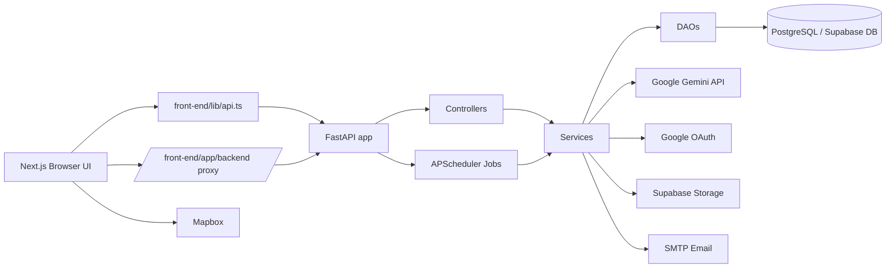
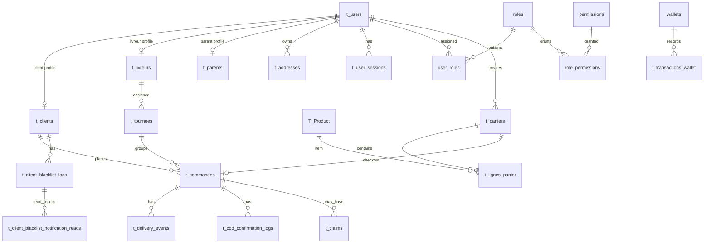

# PROJECT_HANDOFF.md

## 1. Executive Summary
- SOUKI is a Moroccan AgriTech web app for ordering fresh vegetables, managing manual and AI-assisted voice baskets, final checkout, COD risk controls, delivery routing, JIT purchasing aggregation, admin dashboards, product pricing, and client/livreur back-office workflows. The codebase is an active MVP/refactor-stage full-stack project: many core flows are implemented, but some docs are outdated, formal tests/CI are not evident, and several operational concerns remain open.
- Current version / last release date: frontend `front-end/package.json` version is `0.1.0`; no Git tags found; last formal release date is `⚠️ UNKNOWN`.
- Active branch: `Back-09-Gestion-Prix`.
- Last 5 commit messages:
  - `e7c409c 2026-05-18 fix: seuil livraison gratuite 120 → 300 DH`
  - `a336989 2026-05-18 demande de levée blacklist, rejet et notification vue une seule fois`
  - `8e80a2e 2026-05-12 Merge branch 'main' into Back-09-Gestion-Prix`
  - `44c2545 2026-05-12 Update`
  - `8c08a64 2026-05-11 Merge pull request #79 from TahaBourkkadiIdrissi/Back-04/AlgorithmeBouclierdeMargeIA/hz`

## 2. Goals & Scope
- Primary goal: provide a customer-facing ordering experience for fresh produce and a back-office/livreur system to manage orders, COD confirmation, dispatch, pricing, client behavior, claims, wallet, blacklist, and JIT purchase planning.
- Current milestone / sprint objective: `⚠️ UNKNOWN` officially. Recent committed work indicates active focus on delivery pricing threshold, blacklist lift requests/notifications, COD coherence, and admin pricing/dashboard flows.
- Explicit non-goals:
  - Do not touch `back-end/dao/livreur_dao.py` or `back-end/services/livreur_service.py` unless explicitly requested; `regles.md` reserves them for another contributor.
  - Do not use `NotificationOutboxService` for the current blacklist client-page notification flow.
  - Do not change existing SQL tables/entities unless explicitly required; prefer new tables for new persistent state.
  - Do not invent new roles/permissions; use `back-end/rbac_config.py`.
  - Do not use `localStorage` for persistent “notification seen” state when backend persistence is required.
  - Do not use deprecated `/api/commandes/cod/demain`; use `/api/commandes/cod/verouillees`.
- Success metrics:
  - Formal KPIs are `⚠️ UNKNOWN`.
  - Documented/implicit targets include manual checkout requests <500ms and basket retrieval <200ms in older docs, but these are not enforced by tests.
  - Operational correctness targets: COD blacklist blocks only COD, JIT runs at 20:00, COD alert runs at 18:00, dispatch runs nightly, dashboard excludes `BROUILLON` where intended.

## 3. Constraints
- **Technical:**
  - Backend: Python/FastAPI/SQLAlchemy app. Local tool reported Python `3.14.0`; tracked `__pycache__` files also show prior Python 3.13 usage. Required production Python version is `⚠️ UNKNOWN`.
  - Frontend: Next.js App Router, React 19, TypeScript strict mode.
  - Local tested Node: `v24.12.0`; npm: `11.6.2`. Required Node engine is not declared.
  - OS target: development observed on Windows/PowerShell; deployment OS is `⚠️ UNKNOWN`.
  - Browser support: `⚠️ UNKNOWN`; app uses modern Next/React APIs and Mapbox.
- **Performance:**
  - Backend DB pool configured `pool_size=10`, `max_overflow=5`, `pool_timeout=30`, `connect_timeout` default `5`.
  - Next backend proxy timeout is `8000ms`.
  - No bundle budget or memory budget found.
- **Security & compliance:**
  - JWT auth with `python-jose`; RBAC permissions through `require_permission`.
  - Sessions are validated via `UserSessionService`.
  - Google OAuth supported.
  - `SECRET_KEY` is hardcoded in `back-end/config.py` despite comment saying it should be environment-based; this is a security risk.
  - PostgreSQL/Supabase credentials are loaded from `.env` via `user`, `password`, `host`, `port`, `dbname`.
  - GDPR/HIPAA/etc. requirements are `⚠️ UNKNOWN`.
  - Never commit real secrets; current code expects env files and keys.
- **Business:**
  - Budget, deadlines, team size: `⚠️ UNKNOWN`.
  - Third-party dependencies: PostgreSQL/Supabase, Google OAuth/Gemini, Mapbox, SMTP, Vercel Analytics; replaceability constraints are `⚠️ UNKNOWN`.

## 4. Tech Stack
- Language(s) + runtime:
  - Python, local `3.14.0`; runtime target `⚠️ UNKNOWN`.
  - TypeScript `5.7.3`.
  - JavaScript/Node, local `v24.12.0`; runtime target `⚠️ UNKNOWN`.
- Framework(s):
  - FastAPI `0.135.3` and Starlette `1.0.0`.
  - Next.js `^16.2.4`, React `19.2.4`, React DOM `19.2.4`.
  - Tailwind CSS `^4.2.0`, shadcn/Radix-style UI components.
- Database(s) + ORM:
  - PostgreSQL via `psycopg2-binary==2.9.9`.
  - SQLAlchemy `2.0.49`.
  - Supabase storage integration for avatars/product images; `supabase` dependency version not pinned.
  - `prisma/schema.prisma` exists but primary backend uses SQLAlchemy; Prisma usage is `⚠️ UNKNOWN`.
- Infrastructure / hosting / CI-CD:
  - No CI config found in tracked files.
  - Next rewrite/proxy to backend via `BACKEND_INTERNAL_URL` or `NEXT_PUBLIC_API_URL`.
  - FastAPI CORS allows localhost by default plus `FRONTEND_ORIGINS` / `FRONTEND_ORIGIN_REGEX`.
  - Production/staging infrastructure is `⚠️ UNKNOWN`.
- Key libraries:
  - Auth: `python-jose`, `bcrypt==3.2.2`, `google-auth==2.38.0`, `@react-oauth/google`.
  - AI: `google-genai==0.2.0`.
  - Scheduling: `apscheduler==3.10.4`.
  - Maps: `mapbox-gl==3.22.0`, `react-map-gl==8.1.1`.
  - UI: Radix UI packages, `lucide-react`, `sonner`, `recharts`, `react-hook-form`, `zod`.
  - Payments/wallet: custom SOUKI wallet entities/services; external CMI integration appears placeholder/disabled in UI.
  - Queues/outbox: `t_notification_outbox` and `delivery_outbox_worker`; no external queue service found.
  - Observability: console prints; Vercel Analytics dependency. No structured logging/APM found.
  - Testing: no formal pytest/Jest/Playwright config found; `back-end/test_api.http` exists for manual HTTP checks.

## 5. Architecture
- Backend is a layered FastAPI application following the project’s MVC2 rule set: controllers receive HTTP and create/close `LocalSession`, services hold business logic and transactions, DAOs perform SQLAlchemy queries and `flush()`, interfaces define ABC contracts, entities map SQL tables, DTOs serialize/validate payloads. This is codified in `regles.md`.
- Frontend is a Next.js App Router app. Customer pages include home/catalogue/checkout/settings/login; admin pages cover dashboard, orders, clients, blacklist, pricing, livreur, products; livreur and parent pages exist. All normal API calls should go through `front-end/lib/api.ts`; `/backend/[...path]/route.ts` is a server-side proxy to the FastAPI backend.
- Startup path: `back-end/main.py` defines `initialize_application()` for `Base.metadata.create_all`, schema sync, RBAC bootstrap, catalogue bootstrap, and storage bootstrap, but this function is not invoked in the current file. The lifespan handler starts/stops the scheduler only. This is a key operational point to verify before deployment.
- Background jobs are in `services/scheduler_service.py`: COD alert at 18:00, JIT aggregation at 20:00, dispatch at 21:30 Morocco time. Scheduler uses in-process APScheduler.



- Major modules/services:
  - `auth_service`: registration, login, Google login, OTP/session handling, phone blacklist checks.
  - `authorization_service` + RBAC bootstrap: roles, permissions, principal building.
  - `commande_service` + `commande_dao`: voice/text basket parsing, order history, COD locked order queries, client fiche.
  - `panier_service`: manual basket drafts.
  - `checkout_service`: final checkout, minimum basket, delivery fees, stock decrement, COD blacklist enforcement.
  - `jit_service`: per-product volume aggregation, 10% buffer, order locking/unlocking, JIT logs.
  - `cod_confirmation_service`: admin phone confirmation/cancellation for locked COD orders.
  - `dispatch_service`: route/tournee generation, reassignment, anomaly handling.
  - `livreur_service`: livreur tour, delivery events, COD validation, automatic client blacklist on refusal.
  - `client_blacklist_service`: blacklist/lift/lift requests/rejections/client notification read receipts.
  - `dashboard_service`/`dashboard_dao`: dashboard KPIs and curves.
  - `produit_pricing_service`: product pricing, alerts, recalculation.
  - `settings_service`: profile, address, notification preferences, sessions, wallet settings.
  - `souki_wallet_service`: wallet activation and data.
  - `claim_service`: post-delivery claims/refunds.
- Key design patterns:
  - Used: MVC2/layered architecture, dependency injection via FastAPI `Depends`, ABC interfaces, DTOs, repository/DAO pattern, in-process scheduler, outbox table pattern.
  - Intentionally avoided per rules: business logic in controllers, direct DB queries in services where avoidable, commits in DAOs, `localStorage` for durable state, modifying livreur DAO/service casually.

## 6. Repository Structure
```text
.
├── back-end/                         FastAPI backend.
│   ├── api/                          Gemini/system prompt/key helpers.
│   ├── controllers/                  HTTP route handlers.
│   ├── dao/                          SQLAlchemy data-access implementations.
│   ├── dto/                          Pydantic DTOs.
│   ├── entities/                     SQLAlchemy table mappings.
│   ├── interfaces/                   ABC contracts for DAOs/services.
│   ├── services/                     Business logic, scheduling, schema sync.
│   ├── sql/                          Manual SQL migrations/scripts.
│   ├── main.py                       FastAPI app, routers, CORS, lifespan.
│   ├── config.py                     DB engine/session/security constants.
│   └── rbac_config.py                Roles/permissions bootstrap config.
├── front-end/                        Next.js frontend.
│   ├── app/                          App Router pages and route handlers.
│   │   ├── admin/                    Admin dashboard/orders/clients/blacklist/pricing.
│   │   ├── backend/[...path]/        Backend proxy route.
│   │   ├── catalogue/                Customer catalogue/cart.
│   │   ├── checkout/                 Final checkout.
│   │   ├── livreur/                  Delivery UI.
│   │   └── parametres/               Customer settings/profile.
│   ├── components/                   UI and domain components.
│   ├── contexts/                     Auth context.
│   ├── hooks/                        Client hooks for auth/profile/wallet/etc.
│   ├── lib/                          API client, catalogue mapping, utilities.
│   └── public/                       Static assets.
├── Documentation/                    Historical feature docs/reports; some are outdated.
├── prisma/                           Prisma schema present; primary backend is SQLAlchemy.
├── requirements.txt                  Backend Python dependencies.
├── package.json                      Root minimal JS deps.
├── regles.md                         Mandatory project rules and architecture constraints.
├── PROJECT_HANDOFF.md                This file.
└── repomix-output.txt                Flattened source bundle generated for handoff.
```

## 7. Data Model
- Core entities:
  - Users (`t_users`) have roles, sessions, addresses, client/livreur/parent profiles, notification prefs, wallets.
  - Clients (`t_clients`) place paniers and commandes, can be blacklisted.
  - Products (`T_Product`) drive catalogue, pricing, stock, images.
  - Paniers (`t_paniers`) contain lignes (`t_lignes_panier`) and back commandes (`t_commandes`).
  - Commandes are assigned to livreurs/tournees and move through delivery statuses.
  - Blacklist logs (`t_client_blacklist_logs`) track blacklist/lift/request/rejection actions.
  - `t_client_blacklist_notification_reads` stores per-client/per-log read receipts for “restriction COD levée”.
  - COD confirmation logs track admin phone confirmation/cancellation.
  - JIT logs store aggregation runs and per-product JSON details.
  - Claims, wallet transactions, RBAC roles/permissions, notification outbox, delivery events and anomalies support operations.



- Database schema summary:
  - `t_users`: auth identity, role, verification flags, active flag, avatar, login timestamps.
  - `t_clients`: `user_id`, `code_parrainage`, `is_blacklisted`.
  - `t_addresses`: address, neighborhood, coordinates, default flag.
  - `T_Product`: names, price, unit, stock, active, image, pricing strategy fields (`marge_cible`, `coussin_securite`, `niveau`, `volatilite`, `prix_gros_saisi`, `prix_affiche`).
  - `t_paniers`, `t_lignes_panier`: basket totals and item quantities.
  - `t_commandes`: client, panier, livreur, tournee, status, payment mode, total, delivery timestamps, COD/payment flags, client-history delete flag.
  - `T_CommandeVocale`, `T_LigneCommandeVocale`: voice/text AI drafts and lines.
  - `t_tournees`: livreur, date, status, distance.
  - `t_delivery_events`: command status event log with UUID idempotency.
  - `t_anomalies_logistiques`: dispatch anomalies and resolutions.
  - `t_cod_confirmation_logs`: COD confirmation status per order/admin.
  - `t_client_blacklist_logs`: blacklist/audit actions.
  - `t_client_blacklist_notification_reads`: unique read receipts.
  - `t_jit_logs`: JIT run totals/details JSON.
  - `wallets`, `t_transactions_wallet`, legacy `t_wallets`.
  - `roles`, `permissions`, `user_roles`, `role_permissions`.
  - `t_notification_outbox`, `t_user_notification_preferences`, `t_verification_codes`, `t_claims`.
- Important indexes/constraints visible in entities:
  - Unique/indexed user email/phone.
  - Unique roles/permissions codes.
  - Unique user wallet code and wallet user id.
  - Unique `ClientBlacklistNotificationRead(client_id, blacklist_log_id)`.
  - Delivery event `client_event_id` unique.
  - Many FK/index flags are set in entities; additional DB indexes may exist via SQL scripts.
- Important enums/states:
  - Main order states from `commande_state_machine.py`: `BROUILLON`, `EN_ATTENTE`, `CONFIRMEE`, `VERROUILLEE`, `EN_ATTENTE_LIVREUR`, `A_LIVRER`, `EN_ROUTE`, `RETOUR_DEPOT`, `LIVRE`, `ABSENT`, `REFUS`, `REFUS_LIVREUR`, `ANNULEE`.
  - JIT pending/locked: `EN_ATTENTE`/`CONFIRMEE` -> `VERROUILLEE`; unlock -> `CONFIRMEE`.
  - COD confirmation: `NON_CONFIRMEE`, `CONFIRMEE_PAR_APPEL`, `ANNULEE`.
  - Blacklist actions: `BLACKLISTED`, `LIFT_REQUESTED`, `LIFT_REJECTED`, `LIFTED`.
  - Claim status: `REFUNDED`.

## 8. Key Workflows
1. User signup/login:
   - Client/livreur/parent registers through `/auth/register`.
   - Auth service validates role, password/contact, may check blacklisted phone.
   - OTP flow verifies account; login returns JWT and creates/validates user session.
   - Frontend stores token through auth context/hooks and uses it in API calls.
2. Catalogue/manual basket/checkout:
   - User browses `front-end/app/catalogue/page.tsx`, cart is local UI state.
   - Manual basket uses `POST /api/manual-basket` to create draft `t_paniers`/`t_commandes` with status `BROUILLON`.
   - Checkout page loads `panier_id` or voice `commande_id`, collects address/phone/payment.
   - `POST /api/checkout` validates stock, minimum basket `50 DH`, free delivery threshold `300 DH`, COD blacklist, creates final panier/commande `EN_ATTENTE`, decrements stock, commits.
3. Voice/text AI basket:
   - `POST /api/text-basket` or `/api/voice-basket` goes through `CommandeVocaleService`.
   - Gemini parsing maps product aliases to products, builds `T_CommandeVocale` and lines.
   - Checkout loads `/api/commandes/{commande_id}` and finalizes via checkout.
4. COD confirmation and blacklist:
   - Admin loads locked COD orders from `/api/commandes/cod/verouillees`.
   - Admin marks each as `CONFIRMEE_PAR_APPEL` or `ANNULEE`.
   - `ANNULEE` updates command status to `ANNULEE`.
   - If livreur marks delivery `REFUS`, client is automatically blacklisted; blacklist blocks future COD only.
   - Client can request lift; admin can accept/reject; `LIFTED` notification is shown once and persisted via `PATCH /api/client/blacklist/lift-notification-seen`.
5. JIT + dispatch + delivery:
   - Scheduler at 20:00 runs JIT aggregation over `EN_ATTENTE`/`CONFIRMEE`, groups by product, applies 10% buffer per product, rounds up with `ceil`, locks orders, logs `t_jit_logs`.
   - Scheduler at 21:30 generates daily routes for tomorrow and moves orders toward `EN_ATTENTE_LIVREUR`.
   - Livreur starts tour, emits idempotent delivery events, updates status to `EN_ROUTE`, `LIVRE`, `ABSENT`, or `REFUS`, validates COD payment for delivered COD orders.

## 9. Conventions & Standards
- Code style:
  - No explicit formatter config found for Python.
  - Frontend has `npm run lint` (`eslint .`) but no tracked ESLint config found by scan; Next/TypeScript strict mode is enabled.
  - `front-end/next.config.mjs` has `typescript.ignoreBuildErrors: true`, but team still runs `npx tsc --noEmit`.
- Naming conventions:
  - Backend files: snake_case by layer (`*_controller.py`, `*_service.py`, `*_dao.py`, `*_dto.py`, `*_entity.py`, interfaces as `*_interface.py`).
  - Frontend files: App Router `page.tsx`, hooks `useX.ts`, components kebab-case or domain folders.
  - DB tables are mixed legacy (`T_Product`, `T_CommandeVocale`) and newer snake-ish (`t_commandes`, `roles`).
  - Branch naming is mixed; current branch is `Back-09-Gestion-Prix`.
- Testing strategy:
  - Manual HTTP tests in `back-end/test_api.http`.
  - No pytest/Jest/Playwright config found.
  - Current validation commands used by contributors: `python -m compileall back-end`, `npx tsc --noEmit`, `git diff --check`.
  - Coverage targets: `⚠️ UNKNOWN`.
- Git workflow:
  - Remote: `https://github.com/TahaBourkkadiIdrissi/Souki.git`.
  - Branch/PR rules: `⚠️ UNKNOWN`.
  - Merge commits indicate feature branches into `main`/current branch.
- Error handling and logging:
  - Controllers often catch `ValueError`/domain errors and raise `HTTPException`.
  - Services perform `commit()` at end and `rollback()` in `except` per rules.
  - DAOs `flush()` after writes.
  - Scheduler and background jobs use `print()` logs.
  - Frontend uses try/catch, alert/toast/local state errors depending on page.

## 10. Architecture Decision Records (ADRs)
- **Decision:** Use strict MVC2 backend layering.
  - **Context:** Project was restructured to improve maintainability and enforce transaction boundaries.
  - **Alternatives considered:** Monolithic route handlers or ad hoc services.
  - **Rationale:** Clear ownership: controller/session, service/transaction, DAO/query, DTO/serialization, entity/schema.
  - **Date / status:** Documented in `Documentation/ARCHITECTURE_RESTRUCTURED.md` and `regles.md`; active.
- **Decision:** Use FastAPI + SQLAlchemy, not Prisma, as primary backend data layer.
  - **Context:** Python backend needs direct integration with AI, scheduling, and business services.
  - **Alternatives considered:** Prisma schema exists but no active usage found in backend.
  - **Rationale:** Existing entities/DAOs/services are SQLAlchemy-based.
  - **Date / status:** Active; original decision date `⚠️ UNKNOWN`.
- **Decision:** Use JWT + session validation + RBAC permissions.
  - **Context:** Multiple roles (ADMIN, CLIENT, PARENT, LIVREUR) need different dashboards and API access.
  - **Alternatives considered:** Simple role string checks only.
  - **Rationale:** Fine-grained permissions through `require_permission`.
  - **Date / status:** Active; RBAC docs and migration dated April 2026 in SQL filenames.
- **Decision:** Manual checkout creates backend basket drafts before final checkout.
  - **Context:** Catalogue local cart needed stock validation and traceability.
  - **Alternatives considered:** Direct checkout from local cart only.
  - **Rationale:** Earlier validation, unified checkout, better DB traceability.
  - **Date / status:** Documented April 2024 in manual checkout docs; active.
- **Decision:** JIT aggregation runs in-process at 20:00 with APScheduler.
  - **Context:** Need daily wholesale purchase list.
  - **Alternatives considered:** External cron/queue `⚠️ UNKNOWN`.
  - **Rationale:** Simple app-embedded scheduler with DB logs.
  - **Date / status:** Active, but docs still mention email; current controller says log is back-office consultable.
- **Decision:** COD confirmation is a separate admin workflow before delivery.
  - **Context:** Reduce unpaid/refused COD risk.
  - **Alternatives considered:** Let all COD orders enter route unconfirmed.
  - **Rationale:** Admin can confirm/cancel locked COD before dispatch.
  - **Date / status:** Active.
- **Decision:** Blacklist blocks COD only.
  - **Context:** Refusal risk applies to payment at delivery; wallet/CMI prepaid should remain allowed.
  - **Alternatives considered:** Full account block.
  - **Rationale:** Preserves prepaid revenue while mitigating COD loss.
  - **Date / status:** Active; explicit in `regles.md`.
- **Decision:** Persist “blacklist lifted notification seen” in a new table.
  - **Context:** Client should see restriction-lift notification once across devices, no `localStorage`.
  - **Alternatives considered:** `localStorage`, field on `t_clients`, field on blacklist logs.
  - **Rationale:** Durable, per-log, non-invasive to existing entities.
  - **Date / status:** 2026-05-18 commit; active.
- **Decision:** Free delivery threshold is `300 DH`.
  - **Context:** Business threshold changed from `120 DH`.
  - **Alternatives considered:** Previous 120/85 values.
  - **Rationale:** Business request.
  - **Date / status:** 2026-05-18 commit; active.

## 11. Current State of the Code
- Fully implemented and working to the extent verified by static checks:
  - Auth/login/register/session validation/RBAC.
  - Catalogue products and suggestions.
  - Manual basket and checkout.
  - Voice/text basket flow.
  - Admin dashboard, orders, clients, blacklist, pricing pages.
  - COD confirmation logs and 18:00 alert state.
  - Client blacklist request/lift/rejection and one-time lift notification read receipt.
  - JIT aggregation/logging/order lock/unlock.
  - Dispatch/tournee generation and admin route management.
  - Livreur delivery events and COD validation.
  - Settings/profile/photo/wallet/notification preferences.
  - Product pricing and image upload/URL update.
- Partially implemented:
  - CMI/card payment is shown disabled/placeholder in checkout.
  - JIT docs mention email to founder, but current code/comment says log consultable in back-office; email sending is not evident in current JIT controller path.
  - `NotificationOutboxService` exists but current project rules say not to touch it for now.
  - `initialize_application()` exists but is not called in `main.py`; DB schema sync/bootstrap may not run unless invoked elsewhere.
  - Product categorization in catalogue falls back to `legumes`; TODO says admin product categorization is needed.
  - New admin product stock defaults to `900.0`; TODO says stock should be editable.
- Known bugs:
  - Potential operational bug: `initialize_application()` is not invoked in `main.py`.
  - `front-end/next.config.mjs` ignores TypeScript build errors; rely on explicit `npx tsc --noEmit`.
  - Hardcoded `SECRET_KEY` in backend config.
  - `scheduler_service.py` job id/name mismatch: dispatch trigger uses `21:30` but id/name strings mention `21h35`.
  - Historical docs contain outdated email/JIT claims.
- Tech debt and planned refactors:
  - Remove tracked `__pycache__` files from Git.
  - Replace hardcoded secret with env.
  - Add formal test suite.
  - Add CI.
  - Consolidate duplicated admin orders code (`page.tsx` and `admin-orders-client.tsx` are both huge).
  - Add migrations instead of relying on ad hoc schema sync/create_all.
  - Normalize legacy table/status names and mojibake text where safe.

## 12. Open Questions & Blockers
- Is this deployed anywhere? Production/staging URLs are `⚠️ UNKNOWN`.
- Should `initialize_application()` be called during FastAPI lifespan/startup, or is startup/bootstrap run externally?
- Required Python/Node versions for deployment are `⚠️ UNKNOWN`.
- CI/CD workflow is `⚠️ UNKNOWN`.
- Formal product roadmap and sprint owner are `⚠️ UNKNOWN`.
- Payment strategy for CMI is `⚠️ UNKNOWN`.
- Whether to remove outdated docs or update them is undecided.
- Whether to add real DB migrations for new tables/columns is undecided.
- Whether Mapbox and Supabase keys are managed in deployment secrets is `⚠️ UNKNOWN`.

## 13. Roadmap / Next Steps
1. Title: Verify and fix backend startup/bootstrap.
   - Why it matters: `initialize_application()` is defined but not called; DB tables/RBAC/catalogue/storage sync may not run.
   - Acceptance criteria: On app startup, required tables and RBAC/catalogue bootstrap are guaranteed or documented as external; no duplicate scheduler jobs.
   - Estimated effort: M.
   - Files likely to be touched: `back-end/main.py`, schema sync services, deployment docs.
2. Title: Move `SECRET_KEY` to environment.
   - Why it matters: hardcoded JWT secret is unsafe.
   - Acceptance criteria: `SECRET_KEY` required from env or secure default only in dev; auth still works; docs updated.
   - Estimated effort: S.
   - Files likely to be touched: `back-end/config.py`, `.env` docs, deployment docs.
3. Title: Add smoke/integration tests for critical flows.
   - Why it matters: current checks compile only; checkout/COD/JIT/blacklist need behavioral coverage.
   - Acceptance criteria: Tests cover auth, checkout, COD confirmation, blacklist lift/read, JIT aggregation; runnable locally and in CI.
   - Estimated effort: L.
   - Files likely to be touched: new test files, `requirements.txt`, possibly pytest config.
4. Title: Add CI pipeline.
   - Why it matters: prevents regressions.
   - Acceptance criteria: Pull requests run `python -m compileall back-end`, backend tests, `npx tsc --noEmit`, frontend lint/build.
   - Estimated effort: M.
   - Files likely to be touched: `.github/workflows/*`, docs.
5. Title: Update stale JIT/manual checkout docs.
   - Why it matters: docs currently conflict with code about email and startup.
   - Acceptance criteria: Documentation matches current JIT behavior, scheduler times, routes, and schema bootstrap.
   - Estimated effort: S.
   - Files likely to be touched: `Documentation/JIT_AGGREGATION_SYSTEM.md`, `Documentation/IMPLEMENTATION_JIT.md`, handoff docs.
6. Title: Product admin categorization and stock input.
   - Why it matters: TODO says new products fall back to `legumes` and default stock `900.0`.
   - Acceptance criteria: Admin can set product category and stock; catalogue cards use stored category; no hardcoded new-stock default.
   - Estimated effort: M.
   - Files likely to be touched: `front-end/app/admin/pricing/page.tsx`, product DTO/DAO/service/controller, product entity or new category mapping.
7. Title: Decide CMI payment implementation.
   - Why it matters: UI has disabled CMI; COD blacklist messaging says Wallet and CMI remain available.
   - Acceptance criteria: Either CMI integration is implemented or copy/UI clearly says unavailable.
   - Estimated effort: L.
   - Files likely to be touched: checkout backend/frontend, payment entities/services, docs.
8. Title: Remove tracked generated/cache files.
   - Why it matters: `__pycache__`, large generated docs and lock duplication add noise.
   - Acceptance criteria: Generated/cache files removed from Git; `.gitignore` updated; no source lost.
   - Estimated effort: S.
   - Files likely to be touched: `.gitignore`, tracked cache files.
9. Title: Split huge frontend pages.
   - Why it matters: several pages >1000 lines are hard to review and maintain.
   - Acceptance criteria: Extract components/hooks without behavior changes; tsc passes.
   - Estimated effort: L.
   - Files likely to be touched: `front-end/app/admin/orders/*`, `front-end/app/livreur/page.tsx`, `front-end/app/catalogue/page.tsx`, components/hooks.

## 14. How to Run & Test Locally
- Prerequisites:
  - Python version: local tested `3.14.0`; required version `⚠️ UNKNOWN`.
  - Node version: local tested `v24.12.0`; required version `⚠️ UNKNOWN`.
  - npm local `11.6.2`.
  - PostgreSQL/Supabase database reachable.
  - Environment files at repo root `.env` and/or `back-end/.env`.
- Backend setup:
```bash
python -m venv .venv
.venv\Scripts\activate
pip install -r requirements.txt
cd back-end
python -m uvicorn main:app --reload --host 0.0.0.0 --port 8000
```
- Frontend setup:
```bash
cd front-end
npm install
npm run dev -- --hostname 127.0.0.1 --port 3000
```
- Tests/checks:
```bash
python -m compileall back-end
cd front-end
npx tsc --noEmit
npm run lint
npm run build
```
- Manual API checks:
  - Use `back-end/test_api.http`.
  - FastAPI docs are likely at `http://127.0.0.1:8000/docs` when backend runs.
- Required environment variables names only:
  - Backend DB: `user`, `password`, `host`, `port`, `dbname`, optional `DB_CONNECT_TIMEOUT`.
  - Backend auth/Google/AI: `SECRET_KEY` (currently not used by `config.py`), `GOOGLE_CLIENT_ID`, `GEMINI_API_KEY`, `GEMINI_API_KEY_GPA`.
  - Supabase/storage: `SUPABASE_URL`, `SUPABASE_SERVICE_ROLE_KEY`.
  - Email: `SMTP_HOST`, `SMTP_PORT`, `SMTP_USERNAME`, `SMTP_PASSWORD`, `SMTP_FROM`.
  - CORS/deployment: `FRONTEND_ORIGINS`, `FRONTEND_ORIGIN_REGEX`.
  - Depot coordinates: `SOUKI_DEPOT_LAT`, `SOUKI_DEPOT_LNG`.
  - Frontend/backend proxy: `NEXT_PUBLIC_API_URL`, `BACKEND_INTERNAL_URL`.
  - Frontend external: `NEXT_PUBLIC_MAPBOX_ACCESS_TOKEN`, `NEXT_PUBLIC_MAPBOX_TOKEN`, `NEXT_PUBLIC_GOOGLE_CLIENT_ID`.

## 15. External Resources
- Production URL: `⚠️ UNKNOWN`.
- Staging URL: `⚠️ UNKNOWN`.
- GitHub remote: `https://github.com/TahaBourkkadiIdrissi/Souki.git`.
- Figma/design files: `⚠️ UNKNOWN`.
- API docs: local FastAPI `/docs` when backend is running.
- Dashboards/monitoring: `⚠️ UNKNOWN`.
- Related repos: `⚠️ UNKNOWN`.
- Third-party services:
  - Supabase/PostgreSQL.
  - Google OAuth.
  - Google Gemini.
  - Mapbox.
  - SMTP provider.

## 16. Glossary
- SOUKI: Moroccan AgriTech fresh-produce ordering platform.
- COD: Cash on Delivery / paiement à la livraison.
- JIT: Just-In-Time purchasing aggregation for wholesale market buying.
- Back-office / BO: Admin dashboard and operational screens.
- Livreur: Delivery driver.
- Tournee: Delivery route assigned to a livreur.
- Panier: Basket/cart.
- Commande: Order.
- Brouillon: Draft order/basket.
- Verrouillee: Locked order after JIT, generally no longer editable by client.
- CMI: Moroccan card payment network/integration; currently disabled/placeholder in checkout UI.
- Wallet SOUKI: Internal wallet/payment account.
- Blacklist: Client state that blocks COD only.
- Lift request: Client request to remove blacklist.
- `LIFTED`: Blacklist restriction removed by admin.
- `lift_notification_seen`: Backend-persisted flag indicating client has acknowledged the one-time lift notification.
- RBAC: Role-Based Access Control.
- DTO: Data Transfer Object.
- DAO: Data Access Object.
- MVC2: Project’s layered architecture rule set.
- Outbox: DB-backed notification/event queue pattern.
- B2B: Business-to-business product/stock/pricing path.
